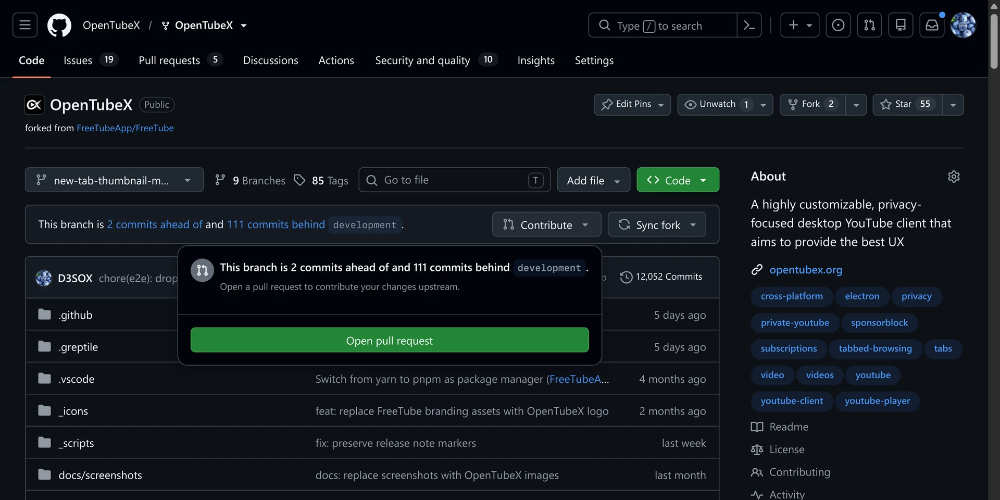
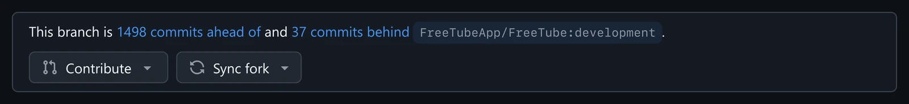
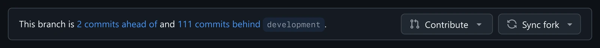
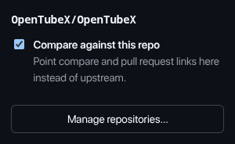

# GitHub Fork Compare Fix

**[gh-fork-compare-fix.d3sox.me](https://gh-fork-compare-fix.d3sox.me)** · available on the
[Chrome Web Store](https://chromewebstore.google.com/detail/github-fork-compare-fix/mkmipkjkkikdfkfciofgmeicmafnkogh);
coming soon to Firefox Add-ons.

On a fork, GitHub points every compare / pull request link at the upstream repository — the "Contribute" menu, the
"Compare & pull request" banner and the "N commits ahead" link in the branch info bar. If you use your fork as a real
repository (own default branch, own PRs), that is the wrong target every single time.

This extension rewrites those links for repositories you configure, so they compare **your branch against your fork's
own default branch**:

```
github.com/upstream/repo/compare/main...owner:repo:my-branch    ->    github.com/owner/repo/compare/my-default...my-branch
```



It also restates the branch info bar against your own default branch, so an enabled fork reads exactly like a
repository that is not a fork — with the commit counts that actually matter to you:

**Before** — counted against upstream, every link opens a pull request against upstream:



**After** — counted against your own default branch, and the links stay in your repository:



Optionally it also redirects when such an upstream compare page is already open.

Works in Chrome and Firefox (Manifest V3, no build step, no dependencies).

## Install

**Chrome / Chromium / Edge** — install it from the
[Chrome Web Store](https://chromewebstore.google.com/detail/github-fork-compare-fix/mkmipkjkkikdfkfciofgmeicmafnkogh).

**Firefox 142+** — `about:debugging#/runtime/this-firefox` → *Load Temporary Add-on* → pick `manifest.json`.
Temporary add-ons are removed on restart; for a permanent install, zip the folder and sign it via
[addons.mozilla.org](https://addons.mozilla.org/developers/) (`zip -r gh-fork-compare-fix.zip manifest.json icons src`).

## Configure

Click the toolbar icon while a repository is open to toggle it on or off — the tab reloads so GitHub re-renders with
the new setting. Repositories enabled through an `owner/*` pattern show up as enabled but can only be changed in the
options page.



The options page (*Manage repositories…* in the popup) takes the same repositories as `owner/repo`, or `owner/*` for
every repository of an owner.

- **Redirect open compare pages** — when enabled, opening an upstream compare page for a configured fork navigates to
  the fork's own compare page instead. Turn it off to only rewrite links.

## How it works

`src/content.js` runs on `github.com` and watches the DOM, because GitHub renders all of this client-side. It:

- rewrites `/compare/` links whose *head* repository is configured while the base repository is a different repo — the
  "N commits ahead" link, "Compare & pull request", the "Contribute" menu. Links pointing the other way around (the
  "N commits behind" link) keep their meaning and are left alone.
- rewrites `/pull/new/<branch>` links, which GitHub would otherwise 302 to the upstream compare page.
- rebuilds the branch info bar sentence (reusing GitHub's own elements, so the styling is theirs).

Data it needs comes from GitHub's own endpoints, using your existing session — no third-party requests, no API token:

- default branch: the repository page's embedded metadata when available, otherwise `/<owner>/<repo>/branches/all`,
  cached in `storage.local` for 24 hours.
- commits ahead/behind your default branch: `/<owner>/<repo>/branches/deferred_metadata`, the same endpoint the
  branches page uses.

## Releasing

Bump `version` in `manifest.json`, then tag that commit:

```bash
git tag v1.0.1 && git push --tags
```

[`.github/workflows/release.yml`](.github/workflows/release.yml) checks that the tag matches the manifest version,
lints, builds a Firefox and a Chrome zip (the Chrome one without the Firefox-only `browser_specific_settings` key) and
publishes them as a GitHub release.

Tagged releases are also submitted automatically to addons.mozilla.org and the Chrome Web Store using these
repository secrets:

| Secret | Used for |
| --- | --- |
| `AMO_JWT_ISSUER`, `AMO_JWT_SECRET` | signing/submitting on addons.mozilla.org ([API keys](https://addons.mozilla.org/developers/addon/api/key/)) |
| `CWS_EXTENSION_ID`, `CWS_PUBLISHER_ID`, `CWS_CLIENT_ID`, `CWS_CLIENT_SECRET`, `CWS_REFRESH_TOKEN` | uploading and publishing on the Chrome Web Store |

The repository variable `AMO_CHANNEL` is set to `listed`, so Firefox releases are submitted for public review. Set it
to `unlisted` to get a signed `.xpi` attached to the release instead.

Run the [`Check store credentials`](.github/workflows/check-store-credentials.yml) workflow manually to verify both
stores' credentials without uploading or publishing a release.

## Credits

Written by Claude (Opus 5) running in [Claude Code](https://claude.com/claude-code) — including the GitHub endpoint
spelunking behind the commit counts, and verified against a real browser session on github.com.

## License

[GPL-3.0](LICENSE)
